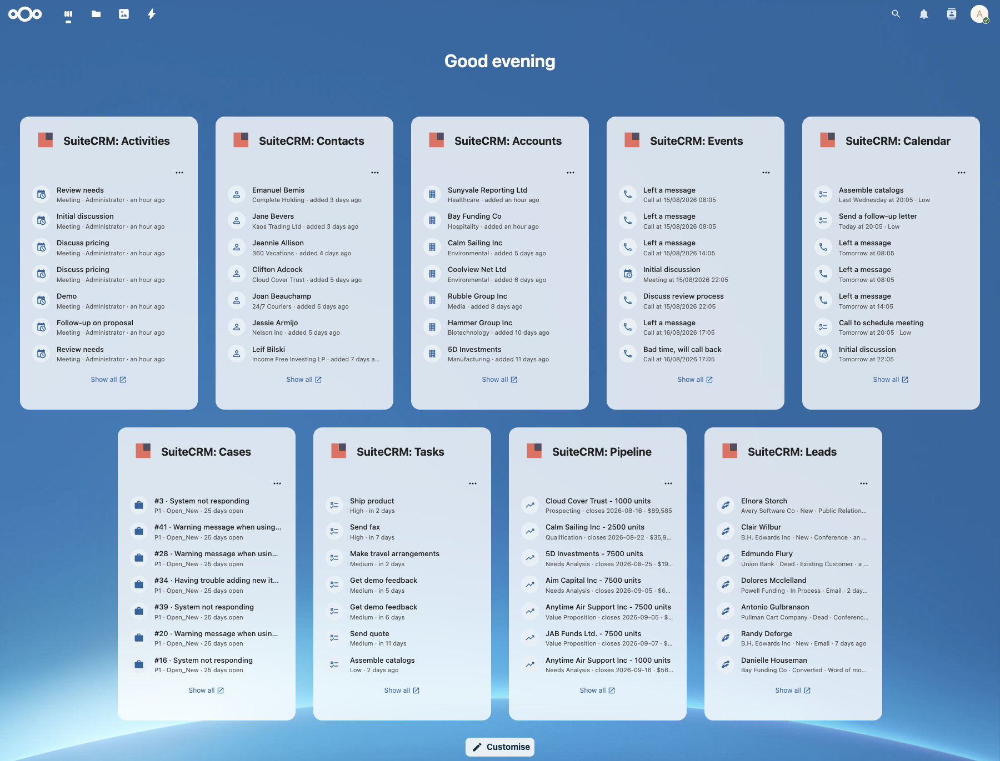

# SuiteCRM integration for Nextcloud

> **Actively maintained fork** of [julien-nc/integration_suitecrm](https://github.com/julien-nc/integration_suitecrm) by Julien Veyssier.
> Updated for **Nextcloud 30 to 35** and **SuiteCRM 8.x**, migrated to Vue 3 / `@nextcloud/vue` v9. Focused on **read-side integration**: nine dashboard widgets (each with its own 3-dot settings menu — per-widget refresh cadence, records-to-show, "Only records assigned to me" filter), reference cards (paste any SuiteCRM URL for a rich preview), unified search, reminder notifications, encrypted token storage, and a companion CalDAV sync module. Write flows (log Talk conversations, link Deck cards, convert emails to Cases, follow-up Tasks, file → SuiteCRM link) live in the companion [`integration_suitecrm_bridge`](https://github.com/njordium/integration_suitecrm_bridge) app.

See your SuiteCRM data from inside Nextcloud. Search records, watch your schedule, workload, recent CRM activity, and newly-added people and companies on your dashboard, get notified about meeting reminders, and paste any SuiteCRM record URL into Talk, Notes, or Files comments for a rich preview card. Every widget carries a 3-dot menu for per-widget refresh cadence, records-to-show, and "assigned to me" filtering.

**Read-only by design.** This app never writes to your SuiteCRM. If you want to write back — log a Talk conversation as a Note, link a Deck card, convert an email to a Case, create a follow-up Task from a widget row, or link a Nextcloud file to any record — install the companion [`integration_suitecrm_bridge`](https://github.com/njordium/integration_suitecrm_bridge) alongside. The two apps are independent; you can run either without the other.



**New here?** Skip straight to [`docs/getting-started.md`](docs/getting-started.md) for the zero-to-connected walkthrough (about 15 minutes end-to-end).

**Upgrading from 2.x?** 3.0.0 renames the Nextcloud app id back from `njordium_suitecrm` to `integration_suitecrm` after Julien Veyssier transferred ownership of the original App Store record to this fork. See [`docs/upgrade-2.x-to-3.0.md`](docs/upgrade-2.x-to-3.0.md); the Migration Repair step copies your existing admin config and every user's OAuth tokens automatically. Upgrading from 1.9.x direct to 3.0.0 is also supported and skips the migration step (your rows are already under the right id).

---

## Features

### Unified search
Search across your SuiteCRM data from Nextcloud's global search bar. Supports:
**Contacts · Accounts · Leads · Opportunities · Cases · Meetings · Tasks · Emails**

Contacts and Leads are filtered on both `last_name` and `first_name`, searching for a first name like "Serena" returns the matching Contact even when their full name is stored differently.

### Dashboard widgets
Nine home-dashboard widgets, grouped by intent, that answer the four questions a SuiteCRM user usually opens the dashboard to check: *what's on my calendar today*, *what's on my plate*, *what's happening in the CRM*, and *who's new*. Enable any subset via **Customize** on the Nextcloud dashboard. Every widget carries a 3-dot settings menu with:

- **Refresh frequency** — Never / 30s / 1m / 5m / 15m / 30m / 1h (default 5 minutes)
- **Records to show** — 5 / 10 / 15 / 20 / 25 / 50 (default 20). Both a display cap and the fetch limit sent to SuiteCRM, so the widget doesn't ask for rows it would drop client-side. Server clamps to `min(100, N)` as a hard ceiling.
- **Only records assigned to me** — on eight of nine widgets. Toggle-on-by-default for Calendar / Cases / Tasks / Pipeline (traditional single-user view); toggle-off-by-default for Activities / Contacts / Accounts / Leads (traditional recent-across-team view). Events has no toggle (reminders are per-user in SuiteCRM's data model).
- **Widget-specific extras** — Calendar exposes "Include Tasks alongside Meetings and Calls"; Pipeline exposes the "Closing this quarter / Top value / Weighted value" framing radio.

**Schedule** — what's on today

- **SuiteCRM: Events**. Reminders for upcoming Calls and Meetings that need your attention.
- **SuiteCRM: Calendar**. Chronological list of assigned Meetings, Calls, and Tasks in the next 7 days, plus past-due items that haven't been dispositioned yet.

**Workload** — what's on my plate

- **SuiteCRM: Cases**. Your open Cases, priority-sorted then oldest-first within priority, so the highest-severity long-open Case surfaces at the top. Row shows case number, name, priority, status, and days-open counter.
- **SuiteCRM: Tasks**. Your open Tasks (Not Started, In Progress, Pending Input). Distinct from the calendar widget in that it *includes undated Tasks* the calendar view drops. Sort is priority DESC then due-date ASC, with undated Tasks moved to the tail of each priority tier.
- **SuiteCRM: Pipeline**. Your open Opportunities, framed by the picker mode in the 3-dot menu. Three modes ship: **Closing this quarter** (default; filters to `date_closed` in the current calendar quarter, sorted earliest first), **Top value** (sort by amount DESC, all open deals), and **Weighted value** (sort by `amount × probability / 100`, matching how finance tracks pipeline).

**Activity** — what's happening in the CRM

- **SuiteCRM: Activities**. Cross-module recent-activity feed covering Calls, Meetings, Tasks, and Notes as SuiteCRM's canonical activity types. Sorted by `date_modified` DESC.

**Discovery** — who's new

- **SuiteCRM: Contacts**. Most recently added Contacts within your ACL, sorted by `date_entered` DESC. Row shows full name (falls back to email for name-less Web-form captures), with account name and date in the subline.
- **SuiteCRM: Accounts**. Most recently added Accounts within your ACL. Subline shows industry and date.
- **SuiteCRM: Leads**. Most recently added Leads within your ACL. Subline shows account, status, lead source, and date, so a fresh Web-form capture ("New / Web") reads differently at a glance from an already-worked cold call ("In Process / Cold Call").

Row icons are chosen per widget for the record type — a person silhouette for Contacts, a handshake for Leads, an office building for Accounts, a briefcase for Cases, a task-list for Tasks, a trending-up arrow for Pipeline. Activities / Calendar / Events dispatch per row (calendar-clock for Meetings, phone for Calls, task-list for Tasks, note for Notes). All widgets share a single color SuiteCRM brand icon in the header. Empty-state uses a check-circle icon so a zero-result widget reads as "you're all caught up" rather than a blank card.

### Reference cards & smart picker
Paste any SuiteCRM record URL (e.g. `.../index.php?module=Contacts&record=abc-123`) into Talk messages, Notes, Deck cards, or Files comments and it renders inline as a rich preview card.

Type `@` in any Nextcloud text field to open the smart picker and search SuiteCRM directly.

### Notifications
Meeting and Call reminders from SuiteCRM show up in Nextcloud's notification tray.

### Companion apps

- **[`integration_suitecrm_bridge`](https://github.com/njordium/integration_suitecrm_bridge)** — the write side. Log Talk conversations as SuiteCRM Notes, link Deck cards, convert emails to Cases, create follow-up Tasks from Calendar / Events widget rows, link Nextcloud files (including Talk call recordings and AI summaries) to any SuiteCRM record. Independent OAuth flow; install alongside this app for the full read + write experience.
- **[`njordium/suitecrm_nextcloud_calendar`](https://github.com/njordium/suitecrm_nextcloud_calendar)** — a SuiteCRM-side module (not a Nextcloud app) for two-way calendar sync via CalDAV. SuiteCRM Meetings and Calls appear in Nextcloud Calendar and vice-versa, with double-booking detection and Nextcloud Appointments booking → SuiteCRM Meeting conversion. The Personal Settings panel here includes a Calendar Companion section that streamlines the SuiteCRM-side setup: shows your Nextcloud URL and username with one-click copy plus a link to generate an app password.

### Built-in diagnostics
Ships with an `occ` command that walks every layer of the connection stack, admin config, SSRF guard, HTTP reachability, authorize endpoint, token endpoint, and reports exactly which layer is broken with the fix command:

```bash
sudo -u www-data php /var/www/nextcloud/occ integration_suitecrm:test-connection
```

Safe to run at any time; does not touch stored user tokens.

### Security
- OAuth2 access + refresh tokens are encrypted at rest using Nextcloud's `ICrypto` service
- Tokens migrated transparently from plaintext (installs upgraded from ≤ 1.1.x)
- **OAuth 2.0 authorization-code flow** (RFC 6749) is the primary connect path; the password grant is kept as a labelled "Advanced" fallback only
- 3.1.0 cleared a full OWASP-Top-10 static review with 0 High + 0 Medium findings; the remaining Low advisories are documented tradeoffs. Widget endpoints clamp caller-supplied `?limit=` to `min(100, N)`. Admin-config writes go through an `ADMIN_ALLOWED_KEYS` whitelist with `sensitive: true` on `client_secret`. The avatar proxy pins Content-Type via image-magic-byte sniff. The OAuth error log redacts the raw guzzle message. The 2.x → 3.x migration preserves the `sensitive` flag on `client_secret`.
- **Read-only surface.** Since 3.2.0 this app carries no write endpoints — nothing in `SuiteCRMAPIController` mutates SuiteCRM state. A compromised session at worst reads what the caller's SuiteCRM ACL already allows. Write flows live in `integration_suitecrm_bridge` where the write-side attack surface is contained.

---

## Requirements

- Nextcloud **30 – 35**
- **SuiteCRM 8.x** with the v8 REST API enabled and OpenSSL keys generated (v7.x is no longer supported)
- PHP **8.3+**

---

## Installation

### From the Nextcloud App Store
Search for "SuiteCRM integration" in Apps → Integration.

### From a release zip (recommended for production)
Download `integration_suitecrm-<version>.zip` from the [Releases page](https://github.com/njordium/integration_suitecrm/releases). Extract it into your Nextcloud `custom_apps/` directory (**not** the bundled `apps/` directory), then enable the app via **Apps → Integration → SuiteCRM integration**. Each release also carries a SHA-256 file; verify integrity with `sha256sum -c integration_suitecrm-<version>.zip.sha256`.

### Manual install (source)
```bash
cd /var/www/nextcloud/custom_apps
git clone https://github.com/njordium/integration_suitecrm.git
cd integration_suitecrm
npm ci
npm run build
```

Then enable it in **Apps → Integration → SuiteCRM integration**.

> **Note (3.1.0+):** the compiled `js/` bundles are now committed on release commits, so a `git clone` + `git checkout v<tag>` gives you a ready-to-serve app without needing node/npm on the host. Same convention as the sibling `integration_forgejo_gitea` app.

---

## Configuration

**First-time setup?** [`docs/getting-started.md`](docs/getting-started.md) is a step-by-step walkthrough from an unconnected SuiteCRM install to a working end-to-end integration with smoke tests. Recommended for anyone doing this for the first time.

Reference version:

### Admin
1. In SuiteCRM, generate OpenSSL private + public keys ([docs](https://docs.suitecrm.com/developer/api/developer-setup-guide/json-api/#_generate_private_and_public_key_for_oauth2)).
2. Create an **OAuth2 Client** in SuiteCRM's "OAuth2 Clients and Tokens" admin section. A single client can be configured to accept both the authorization-code grant (recommended) and the password grant (fallback).
3. In Nextcloud, open **Settings → Administration → Connected accounts → SuiteCRM integration** and enter the SuiteCRM instance URL, client ID, and client secret.
4. **Redirect URI (for OAuth authorization-code flow):**
add `<your-nextcloud-url>/apps/integration_suitecrm/oauth-callback` as an allowed redirect URI on the OAuth2 Client you created in step 2.
5. **Authorize endpoint path** (optional): the default `/Api/authorize` is what SuiteCRM 8.10.x exposes (verified live against a stock install). Older 8.x builds and upgraded-from-7.x installs may need `/legacy/oauth2/authorize` instead. Editable in the admin OAuth settings UI. To set it via the command line instead:
```bash
sudo -u www-data php occ config:app:set integration_suitecrm oauth_authorize_path --value="/Api/authorize"
```
6. **Verify the wiring:**
```bash
sudo -u www-data php occ integration_suitecrm:test-connection
```
Walks every layer of the connection stack and reports exactly which layer is broken. Should print `All checks passed` before any user tries to connect.

### If SuiteCRM is hosted on your LAN or same host as Nextcloud

Nextcloud refuses outbound HTTP to RFC-1918 addresses (10/8, 172.16/12, 192.168/16) and loopback by default, as an SSRF guard. If your SuiteCRM URL is on any of those ranges, the OAuth token exchange will fail with:

```
OAuth access token could not be obtained: Host "<address>" violates local access rules
```

Fix by whitelisting local outbound targets:

```bash
sudo -u www-data php occ config:system:set allow_local_remote_servers --value=true --type=boolean
```

This applies for Docker-on-same-host setups, Proxmox LXC deployments where NC and SuiteCRM are separate containers on the PVE bridge, and any cloud VPC deployment where both apps are on internal-only IPs.

### Per user
Open **Settings → Personal → Connected accounts → SuiteCRM integration** and click **"Connect via SuiteCRM OAuth (recommended)"**. You will be redirected to your SuiteCRM instance to sign in and approve access; on approval you land back in Personal Settings connected.

If your SuiteCRM instance cannot complete the browser redirect back to Nextcloud, expand the **"Advanced: username + password fallback"** section and enter your SuiteCRM login and password (used once to obtain an OAuth token, not stored).

Then enable search and/or reminder notifications from the same panel. Optionally, set a **"Query as a different SuiteCRM username"** value if your OAuth-connected user isn't the one whose records you want the widgets to filter on (typical when the OAuth account is an SSO / shared account distinct from your SuiteCRM login).

For the calendar-sync companion module, use the "Calendar sync (SuiteCRM module)" section for the pre-filled values.

### Connect flow

- **Primary, OAuth 2.0 authorization code (recommended):** clicking "Connect via SuiteCRM OAuth" issues a state-bound authorize URL and redirects the browser to SuiteCRM's login/consent screen. On approval SuiteCRM redirects back to `/apps/integration_suitecrm/oauth-callback`, which exchanges the code for tokens and lands the user back in Personal Settings. Your SuiteCRM password is never sent to Nextcloud.
- **Fallback, password grant (Advanced):** available in the collapsible "Advanced" section for edge cases where a browser redirect back to Nextcloud is not viable (air-gapped setups, installs behind a redirect-blocking proxy, etc). The credentials are used once to obtain a token and never stored.

---

## Deployment scenarios

### Local Docker (dev / test)
Both Nextcloud and SuiteCRM in containers on the same Docker host, talking via the docker bridge. Works out of the box **once you set `allow_local_remote_servers=true`** (the bridge addresses are RFC-1918). The redirect URI in the SuiteCRM OAuth client must match the URL your browser uses to reach Nextcloud (typically `http://<host-ip>:<port>`).

### Behind a reverse proxy (nginx, Apache, Cloudflare Tunnel)
Full working configuration examples are in [`docs/reverse-proxy.md`](docs/reverse-proxy.md), nginx and Apache vhosts (Apache uses PHP-FPM, watch the `<FilesMatch>` handler block or your `.php` files serve as text), Cloudflare Tunnel config, and the `overwriteprotocol`/`overwritehost`/`trusted_proxies` combination the OAuth callback URL generator needs. HAProxy and Traefik work fine in principle (same overwrite trio), we just don't ship tested samples.

### Proxmox LXC (production reference)
Full end-to-end reference in [`docs/proxmox-lxc.md`](docs/proxmox-lxc.md), verified against a live Ubuntu 24.04 LXC running Nextcloud 33. Two-LXC layout (Nextcloud + SuiteCRM), `pct create` templates, install commands using `libapache2-mod-php`, `www-data` crontab for NC cron, PVE-host nginx reverse proxy, backup script that preserves the NC `secret` and SuiteCRM OAuth2 keypair.

### Cloud (AWS VPC, Azure VNet, GCP VPC)
If Nextcloud and SuiteCRM are both cloud-internal (VPC-private IPs), enable `allow_local_remote_servers`. If SuiteCRM is public-facing (has a real DNS name reachable from the internet), no local-access change needed. For managed database backends (RDS, Cloud SQL, Azure Database), Nextcloud's connection is unchanged; only the SuiteCRM URL matters for this integration.

Preserve the `secret` value in Nextcloud's `config.php` across restores, stored OAuth tokens are encrypted with it, and a mismatch will invalidate every user's connection.

---

## Troubleshooting

Keyed by symptom. When in doubt, run `occ integration_suitecrm:test-connection` first, it reports which layer of the stack is broken with the exact fix command.

### `OAuth access token could not be obtained: Host "<addr>" violates local access rules`
Nextcloud's SSRF guard is blocking outbound HTTP to your SuiteCRM's LAN IP. Fix:
```bash
sudo -u www-data php occ config:system:set allow_local_remote_servers --value=true --type=boolean
```

### `invalid_client / Client authentication failed` on the callback
SuiteCRM rejected the client credentials. Two common causes:
1. **Redirect URI mismatch (byte-for-byte).** Compare the URL the browser sent (visible in the address bar during the redirect back) against what's stored in SuiteCRM's OAuth2 Client → `redirect_url` column. Scheme (`http` vs `https`), port, trailing slash, any difference triggers this.
2. **Seeded via SQL with the wrong hash algorithm.** SuiteCRM 8.10.x stores the OAuth2 client secret as raw `hash('sha256', $secret)`, **not** bcrypt (`password_hash`). If you seeded via SQL with `password_hash()` or a bcrypt-style hash, verify:
```sql
SELECT id, secret FROM oauth2clients WHERE id = 'your-client-id';
```
A 64-hex-char value is SHA-256; anything starting with `$2y$` is bcrypt and won't match. The safest fix is to delete the row and recreate the client via SuiteCRM's admin UI (`http://<suitecrm>/#/oauth2-clients/index`), which uses the correct algorithm transparently.

### Personal-settings SuiteCRM section renders empty (no errors in console)
The `js/` bundles are missing. Happens when installing from the source tarball (`/archive/refs/heads/master.tar.gz`) instead of from a proper release or app-store install. On the host:
```bash
cd /path/to/apps/integration_suitecrm
npm ci
npm run build
```
Then reload the settings page.

### `HTTPS 500` on the callback URL immediately after "Continue" in SuiteCRM installer
SuiteCRM 8's Symfony bootstrap requires the `.env` file (not just process env vars). If missing:
```bash
# SuiteCRM ships a `.env` template, restore it if you accidentally overwrote:
cd /path/to/SuiteCRM
git checkout .env # or restore from the release zip
# Put your DB URL + APP_SECRET in .env.local (not .env)
```

Then clear the Symfony container cache, it bakes in the old env vars:
```bash
rm -rf /path/to/SuiteCRM/cache/prod/*
chown -R www-data:www-data /path/to/SuiteCRM/cache
```

### Unified search returns 0 hits despite matching data
1. **Try searching by last name.** Contacts/Leads filter on `last_name` and `first_name` (v1.9.1+); Accounts on `name`. Middle names or aliases won't match.
2. **The user must have `search_enabled` turned on** in Personal Settings.
3. **Assigned-user scope:** dashboard results are scoped to items assigned to the connected user's SuiteCRM ID. If you connected as an admin user in SuiteCRM but the records are assigned to somebody else, expect empty results, this is a security feature, not a bug.

### Browser sends HTTPS to my HTTP-only NC port (400 with `\x16\x03\x01` in access log)
Stale HSTS cache from a previous HTTPS-serving app on the same host:port (e.g. NC AIO on 8443). Clear HSTS for that hostname in your browser (`chrome://net-internals/#hsts` → "Delete domain security policies") or use a different hostname via `/etc/hosts`.

### Reverse proxy: OAuth callback lands on wrong scheme
`overwriteprotocol` isn't set or `overwritecondaddr` doesn't match your proxy's source IP. Test:
```bash
sudo -u www-data php occ config:system:get overwriteprotocol
sudo -u www-data php occ config:system:get overwritehost
sudo -u www-data php occ config:system:get overwritecondaddr
sudo -u www-data php occ config:system:get trusted_proxies
```
All four typically need to be set together for proxy-aware URL generation. Full working nginx/Apache/Cloudflare configurations in [`docs/reverse-proxy.md`](docs/reverse-proxy.md).

---

## Development

```bash
# JS/Vue
npm ci
npm run watch # dev build with file watching
npm run lint # ESLint 9 flat config
npm run stylelint
npm run build # production build

# PHP
composer install
vendor/bin/phpunit # unit tests
vendor/bin/phpstan analyse -c phpstan.neon
```

CI (`.github/workflows/lint.yml`) runs all of the above on every push and PR across PHP 8.3 / 8.4 and Node 20. The release workflow (`.github/workflows/release.yml`) fires on `v*` tag push, re-runs the full lint+test suite as a release gate, and publishes the built zip + SHA-256 checksum to the GitHub Release automatically.

---

## Contributing

Issues and pull requests welcome at [njordium/integration_suitecrm](https://github.com/njordium/integration_suitecrm/issues). When reporting a connection issue, please include the output of `occ integration_suitecrm:test-connection`.

---

## License

AGPL-3.0-or-later. See [COPYING](COPYING).

Original author: Julien Veyssier. Fork maintained by khnjrdm / [njordium](https://njordium.com).
